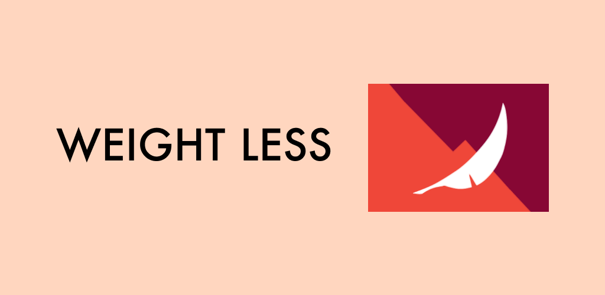

## Tech 👨🏽‍💻
- Navigation Jetpack Component 
- LiveData
- ViewModel 
- Room DB 
- Kotlin Coroutines

## Shoutouts 📣❤️
- Shoutout [Wesley Tang](https://github.com/wesley-tang) for the epic logo
- Shoutout [Firewatch](https://www.firewatchgame.com) (one of my favourite games of all time) for the colour scheme inspiration
- Shoutout [RobinHood](https://robinhood.com) for the amazing [Spark](https://github.com/robinhood/spark) library for the chart 

## TODO 🙇
(Feel free to open a PR for any of these or something else you want in the app 😁)
- [ ] Units for kg/lbs
- [ ] Empty state for chart
- [ ] CSV importing and exporting
- [ ] Setting goal weight (adds a horizontal flat line to chart)
- [ ] Hold & Press to enter bulk-select mode where you can bulk delete
- [ ] Make the chart on vertical view a 30-day view, and then a little expand button at the top can expand it to see lifetime history
- [ ] Homescreen widget for quick entry of weight
- [ ] Google assistant action for quick entry of weight
- [ ] Opt-in cloud back-up
- [ ] Kotlin Multiplatform and other clients
